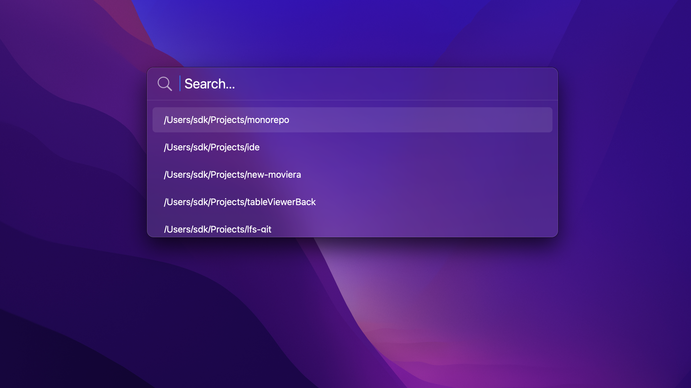

# Mac Menu

A macOS-native GUI implementation inspired by [fzf](https://github.com/junegunn/fzf), providing a clean and modern fuzzy finder interface for your command-line workflows.



## Features

- Native macOS UI with modern design
- Fuzzy search functionality similar to fzf
- Keyboard navigation (Up/Down arrows, Ctrl+P/N)
- Mouse support with hover effects
- Transparent, blur-backed window
- Fast and responsive
- Standard input/output for seamless integration with command-line tools
- Perfect for filtering and selecting from command output

For a detailed overview of Mac Menu, including real-world examples and use cases, check out the [blog post](https://blog.sadiksaifi.dev/mac-menu/).

## Installation

### Using the installation script

```bash
curl -sSL https://raw.githubusercontent.com/sadiksaifi/mac-menu/main/install.sh | bash
```

### Manual Installation

#### Using Make (Recommended)

1. Clone this repository
2. Build and install:

   ```bash
   make
   sudo make install
   ```

3. To uninstall:

```bash
sudo make uninstall
```

## Usage

Basic usage:

```bash
echo -e "Firefox\nSafari\nChrome" | mac-menu
```

The selected item will be printed to stdout.

### Options

- `--persistent`: Disable the close-on-blur behavior. By default, the window closes when you click outside of it. With this flag, the window will remain open until you make a selection or press Escape.

```bash
echo -e "Firefox\nSafari\nChrome" | mac-menu --persistent
```

### Keyboard Shortcuts

- `Up Arrow` or `Ctrl+P`: Move selection up
- `Down Arrow` or `Ctrl+N`: Move selection down
- `Enter`: Select current item
- `Escape`: Exit without selection

## Building

```bash
# Build the application
make

# Clean build files
make clean
```

## Testing

A simple test is included to verify the application with basic input. This test will run the app with "Yes" and "No" as options:

```bash
make test
```

This will build the application (if needed) and launch it with "Yes" and "No" as selectable options. You can interact with the UI as usual (keyboard/mouse), and the selected value will be printed to stdout.

## License

MIT License - See [LICENSE](./LICENSE) file for details.

## Contributing

Contributions are welcome! Please read [contribution guidlines](./CONTRIBUTING.md).
